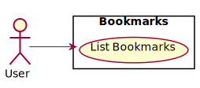
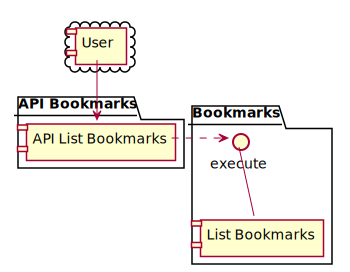

# Iteration 1

## Business requirements

The application will just display a list of bookmarks data:
- the application is distributed on the Web, as a service producing JSON data
- a list of bookmarks is displayed at the URI `/bookmarks/`
- each bookmark is a JSON object which contains just an ID and a URL fields
- bookmarks data is stored in memory on the server
- bookmarks data is a sample, defined in the code

As first iteration, a monolithic application will be enough. The principles of the Clean Architecture will be followed as much as possible.


## Domain

The only domain model currently needed is the Bookmark, representing a link to a resource that is identified by an URL (as such it can be both an online resource, or some file on the local computer, that can be opened in the browser following a `file://` link for example). In addition to the URL, an ID is also defined, to make sure that all Bookmarks are uniquely identified.


## Actors and use cases

At the current moment only one actor is supported by the application, which is the User.


### User

The User uses the features of the application concerning managing Bookmarks: in particular, he can get a pre-defined List of Bookmarks.

```gherkin
Feature: List Bookmarks
    As a User
    I want to get the List of Bookmarks
    In order to see which Bookmarks are available

    Background:
        Given there are the Bookmarks:
            | ID | URL                           |
            | 1  | https://google.com            |
            | 2  | file:///home/myself/file.html |

    Scenario: Get the List of Bookmarks
        When I get the List of Bookmarks
        Then I get:
            | ID | URL                           |
            | 1  | https://google.com            |
            | 2  | file:///home/myself/file.html |
```




## Glossary

- Bookmark: a link to a resource, identified by an URL, that can be followed to display its contents.
- Bookmark URL: the URL of a Bookmark, representing the location where the resource can be retrieved from.
- Bookmark ID: the unique identifier of a Bookmark, to clearly distinguish every Bookmark from every other.
- List of Bookmarks: an ordered set of Bookmarks that are gathered together in order to be used by some actor, for example to be displayed to a User.
- List Bookmarks: create a List of Bookmarks according to some criteria. If no criteria is specified, all Bookmarks are included.
- User: an actor who can use the application's features related to managing bookmarks.


## Ports and adapters

The User actor identifies the intent of communication of managing bookmarks. To it we associate the Bookmarks primary port, exposing use cases related to the User actor, and in particular the List Bookmarks use case.

According to the requirements, we'll need only one adapter, which should respond to the HTTP request `GET /bookmarks/`, and return a JSON array containing a JSON object for each Bookmark of the List of Bookmarks. We'll call this adapter API Bookmarks.

```gherkin
Feature: List Bookmarks from API
    As a User
    I want to get the List of Bookmarks from the API
    In order to be able to process them in an automatic fashion
    
    Background:
        Given the List Bookmarks use case returns:
            | ID | URL                           |
            | 1  | https://google.com            |
            | 2  | file:///home/myself/file.html |
    
    Scenario:
        When I am on "/bookmarks/"
        Then I see a JSON response containing:
            | JSON Object                                        |
            | {"id": 1, "url": "https://google.com" }            |
            | {"id": 2, "url": "file:///home/myself/file.html" } |

```


